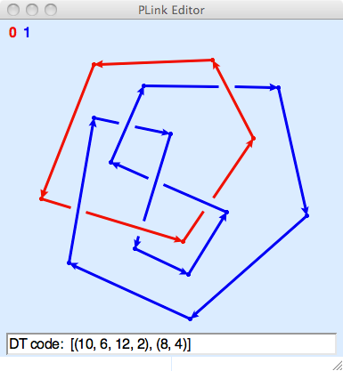

.. PLink documentation master file, created by
   sphinx-quickstart on Wed Apr 29 21:34:28 2009.
   You can adapt this file completely to your liking, but it should at least
   contain the root `toctree` directive.

How to use PLink
=================================

PLink draws planar projections of graphs in 3-dimensional space
with piecewise linear edges.  These include projections of PL knots
or links, of course, but also include graphs which may arise as
the singular set of a 3-dimensional orbifold.

If we define a *filament* to be a maximal subset of the graph which is
homeomorphic to a 1-manifold, then the graph decomposes as a union of
filaments, where two filaments can meet only in one or two vertices
which are boundary points of both filaments.  The filaments are
oriented, so they have a specified meridian; the linear segments in
the diagram (which are called *arrows*) are drawn with an arrowhead
which shows the orientation.  Distinct filaments are drawn in
different colors.

Drawing Basics
------------------------------

* When using the mouse to draw a projection with PLink, all operations
  are prefomed with *click-and-release*.  There is no need hold the
  mouse button down while drawing.  Only the left mouse button is needed,
  although shift-clicks may have different actions.
 
* The default state of the editor is indicated by the arrow cursor.
  In this state, click-and-release the left mouse button on the
  background to place a starting vertex and begin drawing.  The vertex
  will be connected to the pencil cursor by a thin red line.
  Click-and-release to place a second vertex.  The two vertices will
  then be joined by an edge. Continue to draw other vertices and edges.

* To stop drawing, either double-click to create an endpoint
  or click on a vertex.  The latter operation will attack the
  edge which has just been drawn to the vertex.

* When the cursor hovers over a vertex it changes to the open hand if
  the shift key is not pressed.  From this state you can drag a vertex
  to a new location with a click-and-release on the vertex.  Dragging
  the vertex on top of another vertex will cause the vertices to meld.
  If the shift key is pressed then the cursor changes to a target;
  shift-clicking will start drawing a new edge emitting from the
  vertex.

* When the cursor hovers over an edge, not too close to a vertex or
  crossing, it changes to the push-me-pull-you cursor if the shift key
  is not pressed. Clicking changes the orientation of the filament
  containing the edge.  If the shift key is pressed, the cursor will
  be a square containing a central dot; shift-clicking will remove the
  edge and start drawing a new edge from its start vertex.

* When the cursor hovers over a crossing it changes to the yin-yang
  recycling cursor if the shift key is not pressed.  Clicking changes
  the handedness of the crossing. If the shift key is pressed the
  cursor will be a dot; shift-clicking turns the crossing into a
  virtual crossing.

* While in the drawing state, pressing the Delete key removes the last
  vertex before the cursor.  If the last vertex is not valence 2, the
  drawing state ends and the diagram is returned to its state before
  initiating the drawing operation.  This can be used to remove a
  segment from the diagram.  Shift-click on the segment; hit Delete to
  remove the incoming segment at that vertex; then click the end
  vertex of the segment again to reconnect.

* You will not be allowed to create edges that pass too close to a
  vertex or a crossing, or to place vertices too close to edges or to
  crossings or to other vertices.  If you attempt to do any of these
  things, the drawing canvas will flash.

Miscellaneous Features
---------------------------------

The window can be resized to allow for different sizes of link
projections, and the arrow keys can be used to slide the projection
around in order to make more room on one side or another.  The keys
'+', '-', and '0' can be used to zoom in, zoom out, or resize the
diagram to fit the size of the window.

The "Tools" menu can be used to make the projection alternating
(provided that all components are circles), or to clear the screen, or
to reflect the projection in the xy-plane, changing all crossings.
The "Preserve diagram" option disables any operation which could
change the combinatorics of the diagram; a vertex can be moved, but it
cannot be moved across an edge and its adjacent edges cannot be moved
across a vertex. The "Smooth" option opens a new window with a smooth
version of the diagram, rendered with cubic Bezier splines.  When used
within SnapPy, the "Tools" menu includes the "Send to SnapPy" command.

There also are options in the "Tools" menu for zooming or panning
the diagram, but these operations are usually more easily done with
the arrow keys or the '+', '-', and '0' keys.

The "File" menu can be used to save the projection as a SnapPea
link projection file.  (This can be done from the drawing state as
well, in which case the "hot vertex" is remembered in the file!).  The
"File->Open File" command will read a SnapPea link projection file,
and restart drawing if the projection was saved while drawing.

When the diagram is a link projection the "Info" menu selects
information to be displayed in the info line at the bottom.  Various
encoding schemes for link projections are supported, as well as the
blackboard framing curves, expressed in meridian-longitude
coordinates.  Cutting and pasting from the info line is supported.
The numerical and alphabetical Dowker-Thistlethwaite codes are
displayed in an extended form which includes a full description of the
planar embedding.  The string printed in the info line is also
accepted as input to SnapPy's Manifold constructor.  Paste the DT code
between the apostrophes in Manifold('').  The "DT labels" option
displays the indexing used in computing the Dowker-Thistlethwaite
codes.

Credits
=============

Written by `Marc Culler <https://marc-culler.info>`_,
`Nathan Dunfield <https://dunfield.info>`_ and
`Matthias Görner <https://unhyperbolic.org>`_

Contents
============

.. toctree::
   :maxdepth: 2
   
   installing
   plink

